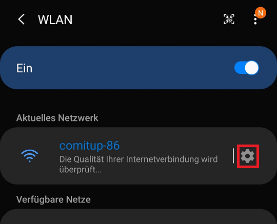
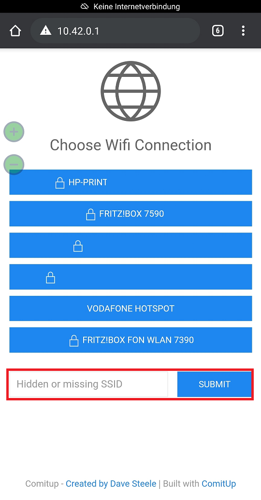

---
# This top area is to give jekyll information about the page.
layout: default
permalink: /dev/comitup/
---

# Installing Comitup

[Commit up on github.com](https://github.com/davesteele/comitup)

## What is Comitup

>Comitup is a software package, which provides a service to establish Wi-Fi networking on a headless computer.

If the Raspberry Pi is not able to establish a Wi-Fi connection, it will broadcast its own Wi-Fi network. We can then use this 
network to connect to the pi via a Wi-Fi capable device to enter the credentials of the Wi-Fi network we want the pi to 
operate in.

## Two ways to Rome

We are currently testing the two different ways to set up Commitup. The developer offers an image on which we would need
to install our software stack. The other possibility is installing the package after we installed the software for running
Rhasspy.

## Installing Comitup
[Original post](https://github.com/davesteele/comitup/wiki/Installing-Comitup)

1. Install the commitup package. 

   ```sudo apt-get install comitup```

2. Allow NetworkManager to manage the Wi-Fi interfaces by removing references to them from `/etc/network/interfaces`.

    ```sudo nano /etc/network/interfaces```

    Here we comment out the last line

    

    

    Press ``ctrl + s`` to save and ``ctrl + x`` to exit nano.

3. If you already added a `wpa_supplicant.conf` file, we will need to rename or delete it again

    ```sudo rm /etc/wpa_supplicant/wpa_supplicant.conf```

4. Disable system.resolve service

    [Guide on askubuntu.com](https://askubuntu.com/questions/898605/how-to-disable-systemd-resolved-and-resolve-dns-with-dnsmasq)

    ```
    sudo systemctl stop systemd-resolved
    sudo systemctl disable systemd-resolved
    ```

5. Masking dnsmasq.service

    > Comitup uses a local configuration of the DHCP setup utility dnsmasq to handle the network configuration of devices
    onnecting to the Comitup hotspot. 

    We want to mask the dnsmasq.service to prevent some known issues with conflicting ports.

    ```
    sudo systemctl mask dnsmasq.service
    systemctl status dnsmasq
    ```

    

6. Reboot

7. Connect to comitup hotspot

    Now we use a Wi-Fi capable device like a laptop or smarrtphone to connect to the hotspot. Open the Wi-Fi network dialog.
    Connect to the network named "Comitup-nn", where nn is a randomized two digit ID. This ID might be important in the next
    step.

8. Enter your Wi-Fi Credentials

    ### For Android

    In this case we used a Galaxy Note 10+ and Google chrome as test device and assume, that other Android devices work
    similarly, but we won't test with other devices.

    For android phones you can enter the Wi-Fi settings. Hold the Wi-Fi icon in your quick-menu.

    

    Tap the cog-icon next to the comitup network.

    

    There you can Tap "Verwalten des Routers"

    

    The browser will open and we can select the ssid of our network or search a hitdden or missing one.

    

    ### For Windows

    After connecting to the comitup hotspot you can enter the following adress in your browser end connect to the comitup dialog.
    "http://comitup-nn.local" remember to replace nn with th networks ID.

    If this is not working you might be able to use "http://10.41.0.1.".

    ### For IOs

    Unfortunately we don't have an IOs device to test on.
