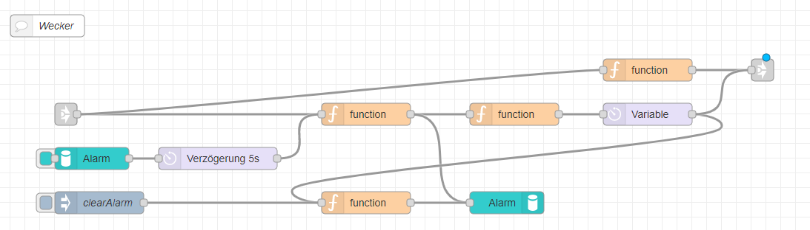
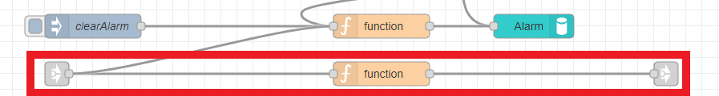
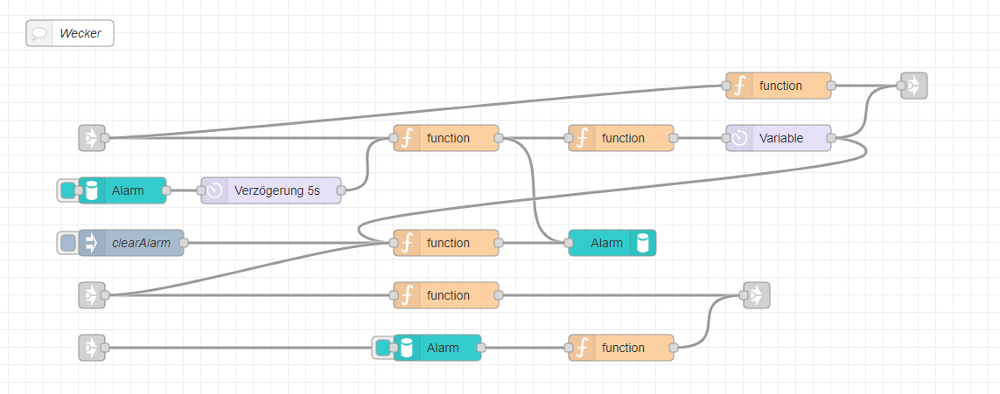

---
# This top area is to give jekyll information about the page.
layout: page
permalink: /epics/alarms/
title: Alarms
---

## Goals
The goal was to set and control permanent alarms, that should not be deleted by a restart.
We want to be able to:
- Set/Delete an alarm
- Stop the alarm
- (Change the sound of the alarm)

## Rhasspy
In Rhasspy we have to add new lines to the `sentences.ini`:
```textmate
    [SetAlarm]
    (setze | stelle) einen wecker (auf | um) (0..24){hours} (uhr)
    (setze | stelle) einen wecker (auf | um) (0..24){hours} (uhr) (0..59){minutes}
    
    [GetAlarm]
    wann (klingelt | geht) (der | mein) wecker
    
    [DeleteAlarm]
    lösche (den | meinen) (aktuellen) wecker
```

#### Example sentences
Some example sentences are:
```textmate
    1. stelle einen wecker um 12 uhr
    2. setzen einen wecker auf 9 uhr 27

    3. wann geht mein wecker
    4. wann klingelt der wecker

    5. lösche meinen aktuellen wecker
```
## Node-Red

The `link-in`-nodes are coming from the "[Intent-Switch](./lights.md#how-to-use-the-rhasspy-websocket)",  
the `link-out`-nodes are connected to our main [TTS-node](./../tech-stack/marytts.md#call-tts-from-node-red).

  
  
The nodes are used for:
- function-node(top): creates TTS-message as command-feedback  

- function-node(mid-left): sets `msg.payload` to `msg.slots` and sets undefined minutes to zero  
- function-node(mid-right): calculates the difference between the system-time and the alarm-time, sets `msg.delay` as milliseconds and creates TTS-message as alarm-sound  
- delay-node(right): delays the `msg`-object by the `msg.delay`-time

- persist-node(left): reads the alarm-time at boot
- delay-node(left): prevents errors by delaying

- injection-node: triggers the clearing of the alarm-time
- function-node(bottom): creates empty `msg`-object to realise deletion
- persist-node(right): stores and deletes alarm-times


  
  
The nodes are used for:  
- function-node: creates TTS-message as command-feedback  
  
  
  
  
The nodes are used for:  
- persist-node: reads the alarm-time
- function-node: creates TTS-message with alarm-time as variable  
  
  
  
*Thats the complete "Alarm-Logic"*