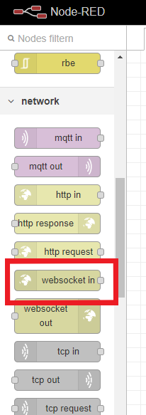
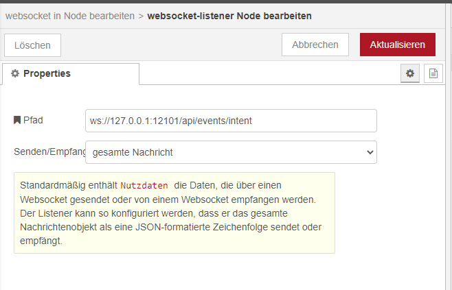
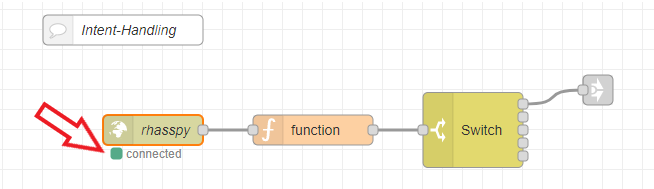
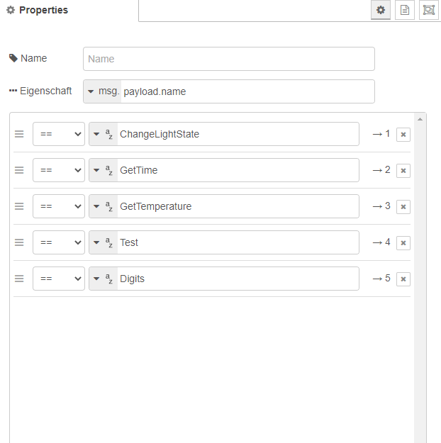
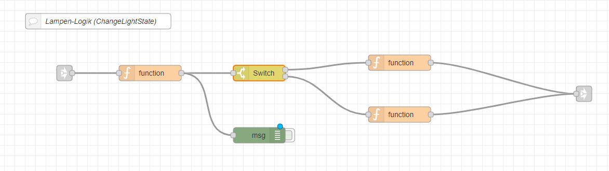

---
# This top area is to give jekyll information about the page.
layout: page
permalink: /epics/lights/
title: Lights
---

## Goals
The goal was that we wanted to control multiple lamps and groups via Rhasspy and Node-Red.  
We wanted to be able to:  
- toggle a light on and off
- change the brightness 
- change the color (if possible)
   
## Rhasspy
In Rhasspy we have to add new lines to the `sentences.ini`:
```textmate
    [ChangeLightState]
    schalte (bitte) (die | das | meine | mein) $name $light_state
    schalte (bitte) (die | das | meine | mein) $name (auf) $light_color
```
Brackets declare an optional section (you do not have to say "bitte", but you may do it).  
The `|` separates alternative words.  
`$name` or `$light_state` are references to slots, which we have to add at the "slots" index tab:
```textmate
   (wohnzimmerlampe | zimmerlampen | testlampen) {name}
```
A slot describes a variable, which later is used to differentiate groups or colors.  

#### Example sentences
Some example sentences are:
```textmate
    1. schalte bitte meine zimmerlampen ein
    2. schalte die wohnzimmerlampe auf grün


    3. schalte testlampen rot
    4. schalte bitte das wohnzimmerlampe warmweiß
```
As you can see Rhasspy do not check the grammar, but since we only use the slots in Node-Red, that does not matter.  
(Slots for `4.` are `wohnzimmerlampe` and `warmweiß`)

## Node-Red

In Node-Red we need the intent and the slots from Rhasspy. To receive these information we use a [websocket](https://rhasspy.readthedocs.io/en/latest/usage/#node-red).  

### How to use the Rhasspy-websocket?

In Node-Red we have to add a "websocket-in" node and set the path to `ws://127.0.0.1:12101/api/events/intent`:

 


You can now see, whether it is connected to Rhasspy or not:  
  

~~~~
The function-node sets the `msg.payload` to `msg.intent` and defines a mqtt-topic to the `slot.name`:  
```js
    msg.payload = msg.intent;
    group = msg.slots.name;
    msg.topic = "zigbee2mqtt/"+group+"/set";
    return msg;
```
This helps to work with the right intent and automatically publishes the data to the right mqtt-topic.  
(e.g. `zigbee2mqtt/wohnzimmerlampe/set`)  

The switch-node directs the `msg` to the following nodes based on the intent:  
  


### ChangeLightState in Node-Red



The nodes are used for:
- function-node: sets `msg.payload` to `msg.slots`
- switch-node: switches based on the keys of `msg.payload` (e.g. `msg.payload.light_state`)
- function-node(top): sets `msg.payload` to "ON" and "OFF" based on input
- function-node(bottom): sets `msg.payload` to a color (e.g. `{"color":{"r":223,"g":223,"b":223},"transition":2}` => white with transition-time of 2 seconds)
- link-node(mqtt): just links to a default "mqtt-out" node (topic and payload are set by previous function-nodes)