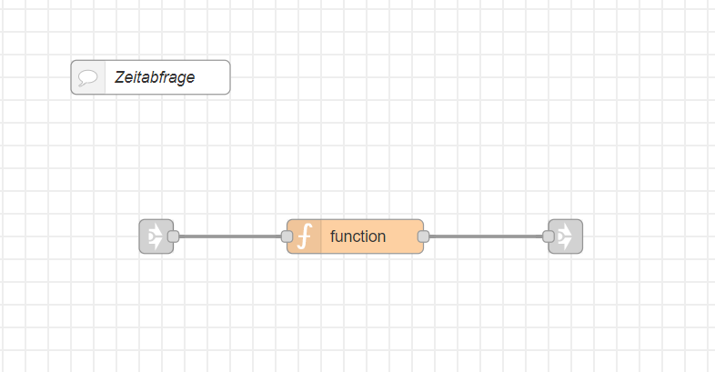

---
# This top area is to give jekyll information about the page.
layout: single
---

## Current Time

## Goals
Our main goal was, to ask Rhasspy for the current time  and made MaryTTS to read it aloud.  
To increase the user experience, we wanted to get a polished and understandable text from Rhasspy.  

## Rhasspy
In Rhasspy we have to add new lines to the `sentences.ini`:
```textmate
    [GetTime]
    wie spät ist es
    sag mir die uhrzeit
```

#### Example sentences
In this case we do not allow that much variation, since we mainly ask:  
*"Wie spät ist es?"*

## Node-Red
For this command we do not need any variables like MQTT-groupnames or anything else, so we do not need slots.  


### GetTime in Node-Red



We only need one function-node, which gets started by our "[Intent-Switch](./../lights.md#how-to-use-the-rhasspy-websocket)".  
This function-node contains a script, which:
  - gets the current time as [ISO8601-String](https://www.iso.org/iso-8601-date-and-time-format.html) 
  - splits the string to separate hours, minutes and seconds
  - adjust the time (+1 hour) to fit our timezone and makes sure, that it won't exceed 24 hours
  - shortens the minutes to one digit, if its under 10 (e.g. "09" -> "9"), to increase the user experience  
  - wraps the hours and minutes into an understandable string
    
```javascript
    message = {};
    // Get Time and convertit to hours (time[0]) and minutes (time[1])
    time = new Date().toISOString();
    time = time.split("T")[1].split(".")[0];
    time = time.split(":");
    // Adjust time to our timezone and crops it to 24h
    time[0] = (parseInt(time[0])+1)
    if (time[0] >= 25){
        time[0] -=24;
    }
    // Adjust time to spell "9" instead of "09" 
    // and e.g. "12 Uhr" instead of "12 Uhr 0"
    time[1] = parseInt(time[1])
    if (time[1] === 0){
        time[1] = "";
    }
    // Create text to be spoken by MaryTTS
    message.payload = "Es ist " + time[0] + " Uhr " + time[1];
    return message;
```
*Code of the function-node.*

The function-node passes the created message to our main [TTS-node](./../../tech-stack/marytts.md#call-tts-from-node-red).