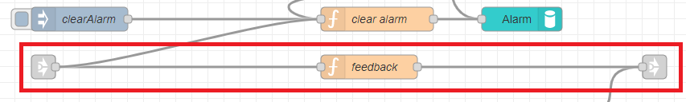

---
# This top area is to give jekyll information about the page.
layout: page
permalink: /features/alarms/
title: Alarms
hero_height: is-low
subtitle: Wake me up before you go go!
---

## Goals
The goal was to set and control permanent alarms, that should not be deleted by a restart.
We wanted to be able to:
- Set/Delete an alarm
- Stop the alarm
- (Change the sound of the alarm)

## Rhasspy
In Rhasspy we have to add new lines to the `sentences.ini`:
```textmate
    [SetAlarm]
    (setze | stelle) einen wecker (auf | um) (0..24){hours} (uhr)
    (setze | stelle) einen wecker (auf | um) (0..24){hours} (uhr) (0..59){minutes}
    
    [GetAlarm]
    wann (klingelt | geht) (der | mein) wecker
    
    [DeleteAlarm]
    lösche (den | meinen) (aktuellen) wecker
```

#### Example sentences
Some example sentences are:
```textmate
    1. stelle einen wecker um 12 uhr
    2. setzen einen wecker auf 9 uhr 27

    3. wann geht mein wecker
    4. wann klingelt der wecker

    5. lösche meinen aktuellen wecker
```
## Node-Red

You can find the flow for all functions of this feature [here](https://github.com/th-koeln-intia/ip-sprachassistent-team2/blob/master/node-red/time_alarm_timer.json).  
*(It is the same flow, we used for the [time-request](./not-required/current-time.md) and the [timer](./timers.md))*  

The left `link-in`-nodes are coming from the "[Intent-Switch](./../tech-stack/hermesmqtt.md#intent-switch)".  

#### SetAlarm
  
  
The nodes are used for:
- `function`-node(top): creates TTS-message as command-feedback  

- `function`-node(center-left): sets `msg.payload` to `msg.slots` and sets undefined minutes to zero  
- `function`-node(center): calculates the difference between the system-time and the alarm-time, sets `msg.delay` as milliseconds
- `delay`-node(center): delays the `msg`-object by the `msg.delay`-time
- `file_in`-node: loads the alarm-sound
- `wav_headers`-node: reads some information from the alarm-sound
- `function`-node(right-top): sets `msg.delay` relative to `msg.duration` from the `wav_headers`-node
- `delay`-node(right): delays the `msg`-object by the `msg.delay`-time

- `switch`-node: switches by incoming intent to either loop the alarm or stop the alarm
- `function`-node(right-bottom):  creates TTS-message as command-feedback

- `persist`-node(left): reads the alarm-time at boot
- `delay`-node(left): prevents errors by delaying

- `injection`-node: triggers the clearing of the alarm-time
- `function`-node(bottom): creates empty `msg`-object to realise deletion
- `persist`-node(right): stores and deletes alarm-times

#### DeleteAlarm
  
  
The nodes are used for:  
- `function`-node: creates TTS-message as command-feedback  
  
#### GetAlarm  
  
  
The nodes are used for:  
- `persist`-node: reads the alarm-time
- `function`-node: creates TTS-message with alarm-time as variable  
  

#### The complete "Alarm-logic"  
  
  
*The `link`-nodes are connected to:*  
- *green: [command-request](./../tech-stack/hermesmqtt.md#command-request)*  
- *blue: [audio-output(TTS)](./../tech-stack/hermesmqtt.md#tts)*  
- *orange [audio-output(.wav)](./../tech-stack/hermesmqtt.md#wav-files)*  

## What's Next?

I want to cook my egg for 59 minutes, please set a [timer](./timers.md)!