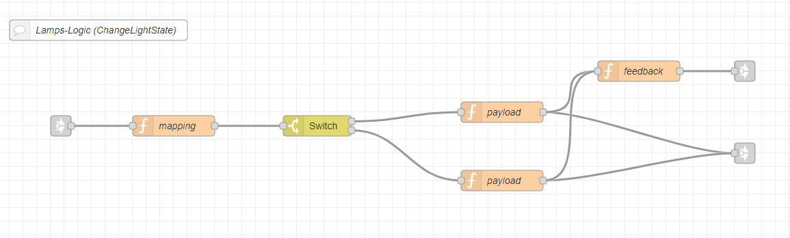

---
# This top area is to give jekyll information about the page.
layout: page
permalink: /features/lights/
title: Lights
hero_height: is-low
---

## Goals
The goal was that we wanted to control multiple lamps and groups via Rhasspy and Node-Red.  
We wanted to be able to:  
- toggle a light on and off
- change the brightness 
- change the color (if possible)
   
## Rhasspy
In Rhasspy we have to add new lines to the `sentences.ini`:
```textmate
    [ChangeLightState]
    schalte (bitte) (die | das | meine | mein) $name $light_state
    schalte (bitte) (die | das | meine | mein) $name (auf) $light_color
```
Brackets declare an optional section (you do not have to say "bitte", but you may do it).  
The `|` separates alternative words.  
`$name` or `$light_state` are references to slots, which we have to add at the "slots" index tab:
```textmate
   (wohnzimmerlampe | zimmerlampen | testlampen) {name}
```
A slot describes a variable, which later is used to differentiate groups or colors.  

#### Example sentences
Some example sentences are:
```textmate
    1. schalte bitte meine zimmerlampen ein
    2. schalte die wohnzimmerlampe auf grün


    3. schalte testlampen rot
    4. schalte bitte das wohnzimmerlampe warmweiß
```
As you can see Rhasspy do not check the grammar, but since we only use the slots in Node-Red, that does not matter.  
(Slots for `4.` are `wohnzimmerlampe` and `warmweiß`)

## Node-Red

You can find the flow for this feature [here](https://github.com/th-koeln-intia/ip-sprachassistent-team2/blob/master/node-red/smarthome_lights.json).

#### ChangeLightState
  
The `link-in`-node is coming from the "[Intent-Switch](./../tech-stack/hermesmqtt.md#intent-switch)".  



The nodes are used for:
- `function`-node: sets `msg.payload` to `msg.slots` and `msg.topic` based on `msg.slots.name`
- `switch`-node: switches based on the keys of `msg.payload` (e.g. `msg.payload.light_state`)
- `function`-node(top): sets `msg.payload` to "ON" and "OFF" based on input
- `function`-node(bottom): sets `msg.payload` to a color (e.g. `{"color":{"r":223,"g":223,"b":223},"transition":2}` => white with transition-time of 2 seconds)
- `function`-node("feedback"): creates  TTS-feedback
- `link`-node(top): just links to our main [TTS-node](./../tech-stack/hermesmqtt.md#tts)
- `link`-node(bottom): just links to a default `mqtt-out`-node (topic and payload are set by previous `function`-nodes)


## What's Next?

How to get the [current time](./not-required/current-time.md)?