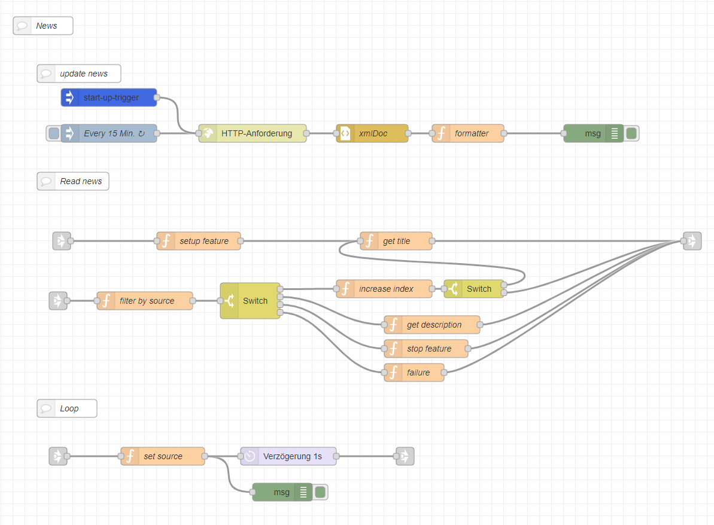
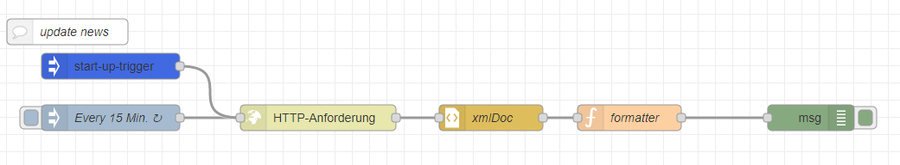
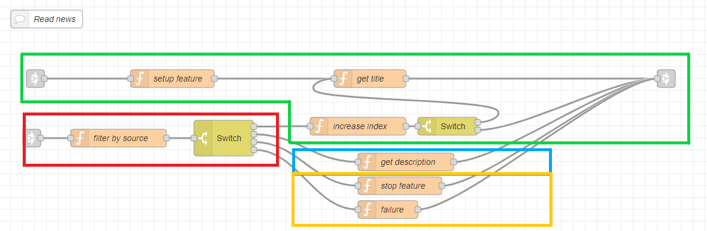
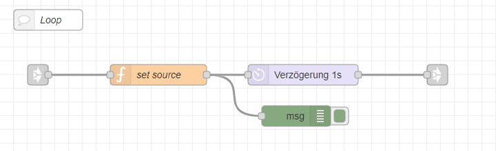

---
# This top area is to give jekyll information about the page.
layout: page
permalink: /features/news/
title: News
subtitle: Stay informed.
hero_height: is-low
---

## Goals
Our main goal was to be able to ask Heimdall for the news.  
He should be able to:
- read some headlines
- give us more information about specific headlines

## Rhasspy
In Rhasspy we have to add new lines to the `sentences.ini`:

```textmate
[News]
lies mir die nachrichten vor
was gibt es für neue nachrichten
was gibt es neues

[NextNews]
weiter
zur nächsten nachricht

[MoreNews]
mehr
ich hätte gerne mehr (infos | informationen)
```

#### Example sentences
Some example sentences are:
```textmate
    1. Lies mir die Nachrichten vor.
    2. Was gibt es Neues?
    
    3. Zur nächsten Nachricht.
    
    4. Ich hätte gerne mehr Infos.
```

## Node-Red

You can find the flow for all functions of this feature [here](https://github.com/th-koeln-intia/ip-sprachassistent-team2/blob/master/node-red/news.json).  
  

### Update the news
 
  
We decided to use the RSS-Feed of the "[Tagesschau](https://www.tagesschau.de/xml/rss2_https/)", because it is free and easy to use.  
  
The nodes are used for:  
- `injection`-node: runs the process every 15 minutes 
- `http-request`-node: requests the RSS-Feed of the "Tagesschau"
- `xml`-node: converts the xml-file to json
- `function`-node: formats the json file and saves it 

### Read the news aloud
  
*The `link-out`-node is connected to our main [TTS-node](./../../tech-stack/hermesmqtt.md#tts).*

The `green` section is used to get the headlines:
- `function`-node(left): setup an index and creates a beginning message for TTS
- `function`-node(top): adds a headline to the message/reads the titles of the news from the stored data
- `function`-node(bottom): increases the index/creates the end of the news block, if there are no news left
- `switch`-node: decides (based on the index) if the next headline should be read or if the feature should be stopped  
  
The `red` section is used to control this feature:
- `function`-node: is connected to the [Command-Request-Callback-Node](./../../tech-stack/hermesmqtt.md#command-request) (via the `link-in`-node) and filters incoming messages by source
- `switch`-node: switches by incoming intents (e.g. `[NextNews]`, `[Stop]`)  
  
The `blue` section is used to get more information about a headline:
- `function`-node: reads the stored description of the headline and creates a TTS-message

The `yellow` section is used to handle wrong intents or `[Stop]`:
- `function`-node(top): creates TTS-message as feedback for the `[Stop]`
- `function`-node(bottom): creates TTS-message as feedback, if there was a wrong or unknown intent detected

### Loop

  
*The `link-in`-node is connected to our [TTS-Callback-Node](./../../tech-stack/hermesmqtt.md#tts), the `link-out`-node is connected to the [Command-Request-Node](./../../tech-stack/hermesmqtt.md#command-request).*  
  
All TTS-messages in this feature, except the one for the `[Stop]` intent, are tagged with the source "news".  
We used this to create a loop to control the output.

The nodes are used for:
- `function`-node: filters by the source
- `delay`-node: delays the message by one second to prevent errors

## Sources
[Tagesschau](https://www.tagesschau.de/)
[Tagesschau-RSS](https://www.tagesschau.de/xml/rss2_https/)

## What's Next?

You want to know how it works?  
Look at our [Tech-Stack](./../../tech-stack/index.md)!