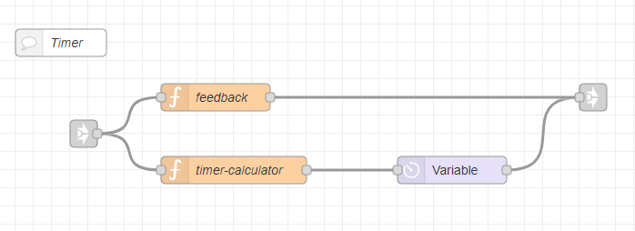

---
# This top area is to give jekyll information about the page.
layout: page
permalink: /features/timers/
title: Timers
---

## Goals
The goal was to set a timer via a voice command.

## Rhasspy
In Rhasspy we have to add new lines to the `sentences.ini`:
```textmate
    [SetTimer]
    setze einen timer auf (0..300){seconds} sekunden
    setze einen timer auf (0..120){minutes} minuten
    setze einen timer auf (0..12){hours} stunden
    setze einen timer auf (0..120){minutes} minuten und (0..59){seconds} sekunden
    setze einen timer auf (0..24){hours} stunden und (0..59){minutes} minuten
    setze einen timer auf (0..24){hours} stunden (0..59){minutes} minuten und (0..59){seconds} sekunden
```

#### Example sentences
Some example sentences are:
```textmate
    1. setze einen timer auf 250 sekunden
    2. setze einen timer auf 2 stunden und 13 minuten
    3. setze einen timer auf 4 minuten 
    4. setze einen timer auf 3 stunden 24 minuten und 33 sekunden
```

## Node-Red

You can find the flow for all functions of this feature [here](https://github.com/th-koeln-intia/ip-sprachassistent-team2/blob/master/node-red/time_alarm_timer.json).  
*(It is the same flow, we used for the [time-request](./not-required/current-time.md) and the [alarm](./alarms.md))*

The `link-in`-node is coming from the "[Intent-Switch](./../tech-stack/hermesmqtt.md#intent-switch)".  
The `link-out`-node is connected to our main [TTS-node](./../tech-stack/hermesmqtt.md#tts).

  
  
The nodes are used for:
- `function`-node(top): creates TTS-message as command-feedback  
- `function`-node(bottom): calculates the time, sets `msg.delay` as milliseconds and creates TTS-message as timer-sound  
- `delay`-node: delays the `msg`-object by the `msg.delay`-time
