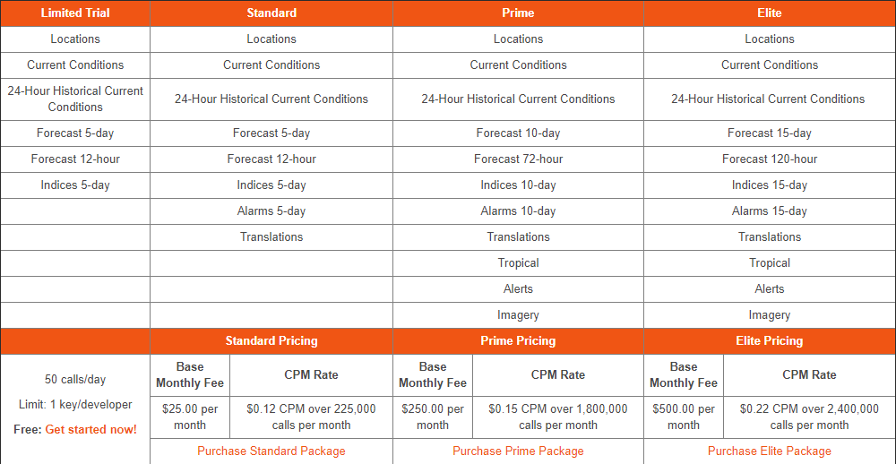
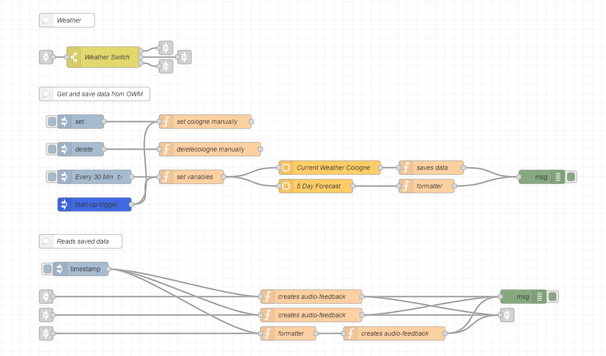
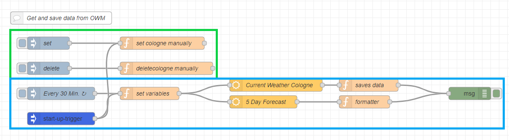
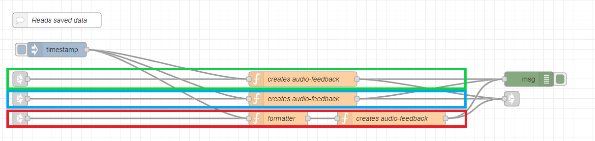

---
# This top area is to give jekyll information about the page.
layout: page
permalink: /features/weather/
title: Weather-service on Rhasspy
hero_height: is-low
subtitle: There is no such thing as bad weather...
---

## Goals

We want to ask Heimdall for the current or future weather, maybe also for a forecast for tomorrow or during the next week
at our current location. In addition it would be nice to ask for the current weather and forecast in other places.

## Weather-API
For our weather API the same basic criteria apply as for our other technologies, it should be DSGVO conform, free of charge,
or even open-source. Of course the service should give us reliable data. In the following we looked at Accuweather (Accu], Dark Sky (DS),
Deutscher Wetterdienst (DWD) and openweathermap(OWM).

### Comparrison

| Criteria      |Weight | Accu  | DS    | DWD   | OWM   |
|---------------|:-----:|:-----:|:-----:|:-----:|:-----:|       
| Privacy       | 4     | X     | X     | 10    | 8     |
| Opensource    | 1     | 0     | 0     | 5     | 5     |
| free of charge| 2     | 0     | X     | 10    | 8     |
| Usability     | 3     | X     | X     | 5     | 7     |
| Total         |       | 0     | 0     | 72    | 74    |

We gave each criteria a weight which we use to multiple our "educated guesses" for points with. The sum of each providers
points times the weight factor is the Basis of our Criteria. We used X if we did not find information about a given criteria
or the Provider did not match a critical one like, basic privacy or being available free of charge.

#### About open-source

There are open standardised weather algorithms and most weather stations publish there data in one way or another. Most 
providers use these algorithms to prepare and redistribute and redistribute the data. But there codebase itself is usually not 
public. But we want to give points for good business practices and  

#### [accuweather](https://www.accuweather.com/)

Accuweather is not free, the following table shows their pricing, structure.



[developer.accuweather.com/packages](https://developer.accuweather.com/packages)

#### [Dark Sky](https://darksky.net)

Dark Sky got acquired by Apple in March 2020.

> Dark Sky said its API service, which allows other apps to use its weather data, will no longer accept new signups and 
> will continue to function through the end of 2021. Several other weather apps rely on Dark Sky’s data, which means 
> they’ll have to find another source.

[CNBC](https://www.cnbc.com/2020/03/31/apple-buys-popular-weather-app-dark-sky.html)

Because their data will no longer be publicly available outside the Apple eco system the missed the critical criteria of
being publicly available and free of charge.

#### [Deutscher Wetterdienst (dwd)](https://www.dwd.de/DE/derdwd/derdwd_node.html)

> The Deutscher Wetterdienst is a public institution with partial legal capacity under the Federal Ministry of Transport
> and Digital Infrastructure.

DWD provides meteorological data and research to the economy and society.
DWD only offers their data as zipped files and there is no API to access it. But there is a
[pallet](https://flows.nodered.org/node/node-red-contrib-dwd-local-weather) in node-red, that provides
data from DWD. To request the current weather or a forecast, we need to extract the ID of the closest weather station from
the [List of weather stations](https://www.dwd.de/DE/leistungen/met_verfahren_mosmix/mosmix_stationskatalog.cfg?view=nasPublication&nn=16102)
and give it to the dwd-node this might be possible with a function-node. But there is a restriction with 
[Kaldi](../tech-stack/kaldi.md)
, we would need to enter every location, which we want to support, into Kaldi's dictionary.

#### [openweathermap.org](https://openweathermap.org/)

Openweathermap provides current, future and historical weather data available in JSON over an API. There is a node Red
pallet, that offers current weather and a 5 day forecast.

To use openweathermap we need to register and use an API key for every data request. That's why we redact some points from
privacy. It is possible to use the same key for a lot of different devices at the same time and with a free key we can
 make up to 60 calls per minute. The next tier would be 600 calls per minute for 40$ per month. If we have a lot of devices
 deployed in the future, every institution might use its own API key to prevent hitting the 60 calls per minute cap.
 If ever device makes a call in an specific interval and stores the data in a global variable, weather request from the
 user might be a bit faster, at the cost of a little accuracy or actuality. Furthermore it makes the need of API keys
 predictable.

On [openweathermap.org](https://openweathermap.org/find?q=) we can search for our location or city and enter the name and
two character country code into the node, to get the local weather data. This is also dynamically possible via a function node
but not yet implemented.

### Conclusion

The scores of DWD and OWM were pretty close and we would prefer to use OWM because it is a bit easier to use.


## Rhasspy
In Rhasspy we have to add new lines to the `sentences.ini`:
```textmate
    [GetTemperature]
    wie ist die temperatur (heute)
    wie (heiß | kalt | warm) ist es (heute)
    
    [GetWeather]
    wie (ist | wird) das wetter (heute)
    
    [GetForecast]
    wie wird das wetter (die | in den) nächsten 5 (tage | tagen)
    ich hätte gerne den wetterbericht für die nächsten 5 tage
```

#### Example sentences
Some example sentences are:
```textmate
    1. Wie warm ist es heute?
    2. Wie wird das Wetter heute?
    3. Wie wird das Wetter in den nächsten 5 Tagen?
    4. Ich hätte gerne den Wetterbericht für die nächsten 5 Tage
```
## Node-Red

You can find the flow for all functions of this feature [here](https://github.com/th-koeln-intia/ip-sprachassistent-team2/blob/master/node-red/weather.json).  

  
*All intents enter the flow at the very first `link-in`-node and get split by the `Weather-Switch`*

### Get and store the weather-data
  
`Green` section:  
- All these nodes are just used to set/delete the global variables `city` and `country`, which are later used to get the weather of a specific region (in our case Cologne)
  
`Blue` section:
- `injection`-node: initiates the process every 30 minutes
- `function`-node(left): sets `msg.location.city` and `msg.location.country` to the global variables
- `openweathermap`-node(top): requests the current weather-data at a certain location
- `openweathermap`-node(bottom): requests a five-day-forecast for a certain location
- `function`-node(top): saves the data of the current weather 
- `function`-node(bottom): formats the five-day-forecast-data to make the later use easier

*To change the location to your city, you can simply change the city and country names in the top `function`-node of the first `green` section (`"set cologne manually"`).
Openweathermap only update their data every 3 hours, so you may want to change the `injection`-node to trigger every 3 hours or less.*

### Read the data aloud
  

`Green` section (`[GetTemperature]`):
-  `function`-node: extracts the temperature from the stored weather-data and creates a TTS-message

`Blue` section (`[GetWeather]`):  
-  `function`-node: extracts the temperature and some additional data from the stored weather-data and creates a TTS-message 

`Red` section (`[GetForecast]`):
- `function`-node(left): reformats the five-day-forecast-data and adds the weekday-names
- `function`-node(right): creates a TTS-message from the formatted data

The `link-out`-node is connected to our main [TTS-node](./../tech-stack/hermesmqtt.md#tts).

## Sources
[accuweather](https://www.accuweather.com/)
[Dark Skies](https://darksky.net)
[Deutscher Wetterdienst (dwd)](https://www.dwd.de/DE/derdwd/derdwd_node.html)
[openweathermap.org](https://openweathermap.org/)
[cstain.io](https://cstan.io/?p=12097&lang=en)

## What's Next?

What happened in the world?
Get the [news](./not-required/news.md)!