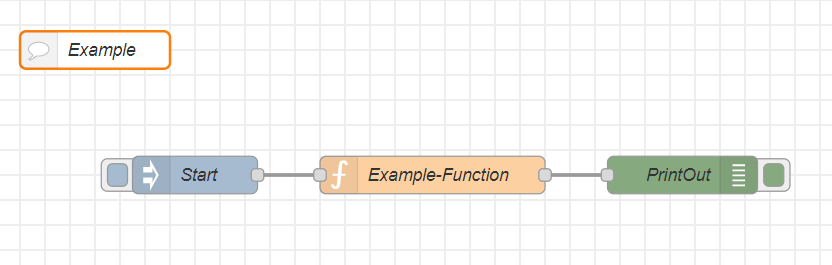
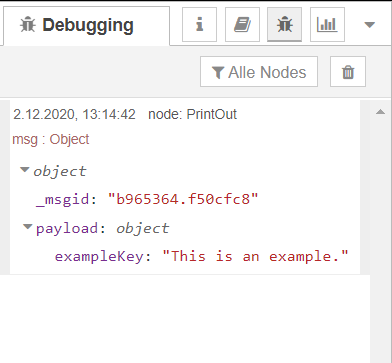

---
# This top area is to give jekyll information about the page.
layout: page
permalink: /information/node-red/
title: Node-Red
---


## What is Node-Red?
Node-Red is a simple node.js based tool, to realize IoT-usecases.  
To use it you have various nodes, which can be connected to each other by simply drag lines between them.  
These lines represent the handing over of a JSON-object from one javascript function to another.  

## Flows
A flow is a cluster of nodes, which are connected to each other.  
It is comparable to a main-function, where multiple functions get executed one after another.  

  
*This is an example flow.*  

At the flow above you can see three different nodes.  
An `inject`-node, that starts the flow and passes an empty `msg`-object:  

```json
{
  "_msgid": "b965364.f50cfc8",
  "payload": {}
}
```

A `function`-node, which adds a new key with a string as value to `msg.payload`:  

```json
{
  "_msgid": "b965364.f50cfc8",
  "payload": {
    "exampleKey": "This is an example."
  }
}
```

And finally a `debug`-node, that prints out the `msg`-object to the debug-section of Node-Red:  

  

## Social Development
New Nodes can be created and published by the community and other users can add them for free.  
Flows can be imported and exported as JSON-files, to share them with others.  
(You will find all of our flows we used in this project in our [GitHub-Repository](https://github.com/th-koeln-intia/ip-sprachassistent-team2/tree/master/node-red))

```json
[
    {
        "id": "1f733f16.ba2631",
        "type": "tab",
        "label": "Example",
        "disabled": false,
        "info": ""
    },
    {
        "id": "3e83b5a7.9b7d5a",
        "type": "comment",
        "z": "1f733f16.ba2631",
        "name": "Example",
        "info": "",
        "x": 160,
        "y": 100,
        "wires": []
    },
    {
        "id": "c9e7af2a.ea8cd",
        "type": "inject",
        "z": "1f733f16.ba2631",
        "name": "Start",
        "props": [
            {
                "p": "payload"
            }
        ],
        "repeat": "",
        "crontab": "",
        "once": false,
        "onceDelay": 0.1,
        "topic": "",
        "payload": "{}",
        "payloadType": "json",
        "x": 240,
        "y": 200,
        "wires": [
            [
                "62912d2c.880714"
            ]
        ]
    },
    {
        "id": "62912d2c.880714",
        "type": "function",
        "z": "1f733f16.ba2631",
        "name": "Example-Function",
        "func": "msg.payload.exampleKey = \"This is an example.\";\nreturn msg;",
        "outputs": 1,
        "noerr": 0,
        "initialize": "",
        "finalize": "",
        "x": 430,
        "y": 200,
        "wires": [
            [
                "cb2b2cc0.f0cb9"
            ]
        ]
    },
    {
        "id": "cb2b2cc0.f0cb9",
        "type": "debug",
        "z": "1f733f16.ba2631",
        "name": "PrintOut",
        "active": true,
        "tosidebar": true,
        "console": false,
        "tostatus": false,
        "complete": "true",
        "targetType": "full",
        "statusVal": "",
        "statusType": "auto",
        "x": 630,
        "y": 200,
        "wires": []
    }
]
```
*This is the flow from the [image](./node-red.md#flows) above.*  

If you want to use our flows, you just have to import them to your Node-Red webinterface.  