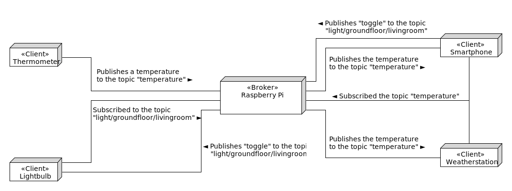

---
# This top area is to give jekyll information about the page.
layout: default
---

# MQTT
## What is MQTT?

MQTT is a Messaging-Protocol, that allows us to build up a connection between clients and a so-called "broker", fast and efficiently.   
It's easy to use and scalable in very big dimensions.   
A MQTT-Client doesn't need many resources, it even could be a micro-controller inside of a lightbulb (e.g. the "[Phillips Hue](https://www.philips-hue.com/de-de?origin=5XbPK3Jx&pcrid=327207180200|mckv|s5XbPK3Jx_dc|plid||slid||pgrid|55190619822|ptaid|kwd-44175898474|product||&gclid=CjwKCAjw5Kv7BRBSEiwAXGDElXfN-5RR97N3apPXwEvxo5QudxmhwCJSi9kZp0fMooQcFjuReLc5oBoCt7cQAvD_BwE)")

## How does it work?



       
   
MQTT uses a "publisher/subscriber"-system. One or more clients publish their data to a topic, which other clients are able to subscribe to.  
The broker has a connection to all clients and decides which subscriber receives which data based on the topics.    


#### Topics 

A topic is a UTF-8 string with different "levels" separated by forward slashes and looks like this:    
     
```
smarthome/kitchen/lamps/top/turquoise
smarthome/kitchen/lamps/#
```
A `#` addresses all sublevel after it, in our case all lamps in the kitchen.  
Due to security reasons most broker don't allow subscribing to a single `#`.    
    


#### Payload

A publisher send its data wrapped in a Payload.       
In our case (we're using a "[Phillips Hue](https://www.philips-hue.com/de-de?origin=5XbPK3Jx&pcrid=327207180200|mckv|s5XbPK3Jx_dc|plid||slid||pgrid|55190619822|ptaid|kwd-44175898474|product||&gclid=CjwKCAjw5Kv7BRBSEiwAXGDElXfN-5RR97N3apPXwEvxo5QudxmhwCJSi9kZp0fMooQcFjuReLc5oBoCt7cQAvD_BwE)") it is a JSON file and can look like this:   

```JSON
{
    "state": "ON",
    "color": {
        "r": 0,
        "g": 255,
        "b": 255
    }
}
```
*The above code will turn on the lamp with a bright turquoise color*


#### QOS

QOS stands for quality of service and describes how often a packet should be delivered.  
There are three levels of QOS:  
   - **One or Less** delivery (0)
   - **At least one** delivery (1)
   - **Exactly one** delivery (2)


#### Retain

If the retain-flag of a message is true, the broker will store this message and send it to every new subscriber.  
The broker stores only one message per topic.


