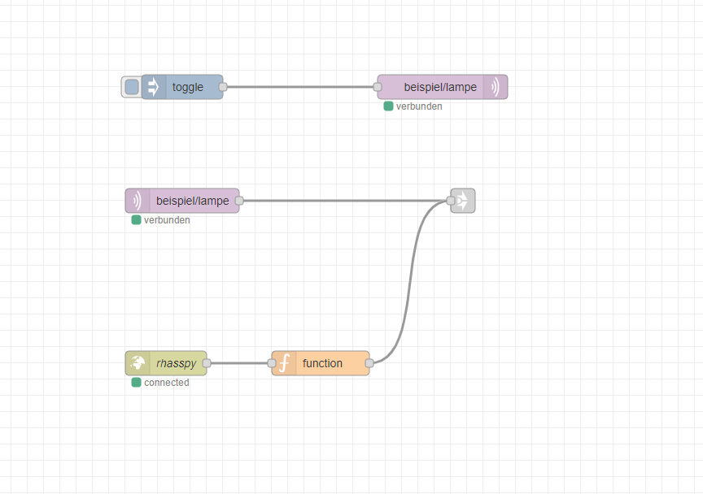

# Node-Red
## What is Node-Red?
Node-Red is a simple tool, to visualize usecases. Functionblocks are linked by drawing connections.
programming language is javascript. Node-Red based on node.js. 

## A Flow
Node-RED, different input, output and processing nodes can be connected to one another in one flow. This allows various things to be monitored and controlled.
Each node has a defined and unique task.
If data transmitted to a node, the node can process this data and pass it on to the next node.

## Social Development
Flows in Node-Red can be import and export as JSON-files, to share them with others.