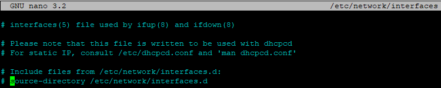
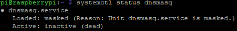

---
# This top area is to give jekyll information about the page.
layout: page
permalink: /tech-stack/comitup/
title: Installing Comitup
---

## What is Comitup

>Comitup is a software package, which provides a service to establish Wi-Fi networking on a headless computer.

If the Raspberry Pi is not able to establish a Wi-Fi connection, it will broadcast its own Wi-Fi network. We can then use this 
network to connect to the pi via a Wi-Fi capable device and enter the credentials of the Wi-Fi network we want the pi to 
operate in.
[Commit up on github.com](https://github.com/davesteele/comitup)

## Two ways to Rome

We are currently testing the two different ways to set up Comitup. The developer offers an image on which we would need
to install our software stack. The other possibility is installing the package after we installed the software for running
Rhasspy.

## Installing Comitup
[Original post](https://github.com/davesteele/comitup/wiki/Installing-Comitup)

1. Install the Comitup package. 

   ```sudo apt-get install comitup```

2. Allow NetworkManager to manage the Wi-Fi interfaces by removing references to them from `/etc/network/interfaces`.

    ```sudo nano /etc/network/interfaces```

    Here we comment out the last line

    

    

    Press ``ctrl + s`` to save and ``ctrl + x`` to exit nano.

3. If you already added a `wpa_supplicant.conf` file, we will need to rename or delete it again

    ```sudo rm /etc/wpa_supplicant/wpa_supplicant.conf```

4. Disable system.resolve service

    [Guide on askubuntu.com](https://askubuntu.com/questions/898605/how-to-disable-systemd-resolved-and-resolve-dns-with-dnsmasq)

    ```
    sudo systemctl stop systemd-resolved
    sudo systemctl disable systemd-resolved
    ```

5. Masking dnsmasq.service

    > Comitup uses a local configuration of the DHCP setup utility dnsmasq to handle the network configuration of devices
    connecting to the Comitup hotspot. 

    We want to mask the dnsmasq.service to prevent some known issues with conflicting ports.

    ```
    sudo systemctl mask dnsmasq.service
    systemctl status dnsmasq
    ```

    

6. Reboot

7. After the pi rebooted it should broadcast a comitup Wi-Fi network
    
## Using the Comitup Image

Since we added Comitup to our tech-stack afterwards we have not tried to use a comitup image as base for our setup. You 
can find up to date images at[davesteele.github.io/comitup/](https://davesteele.github.io/comitup/) and install them
according to our [Getting Started Page](../setup.md).

## Connecting to Wi-Fi

Please read our [user-guide](../users/wi-fi.md) on how to connect to use the Comitup-network.

## What's next?

[Mycroft-Precise](./mycroft.md)


