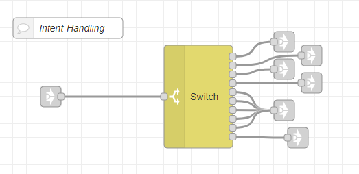
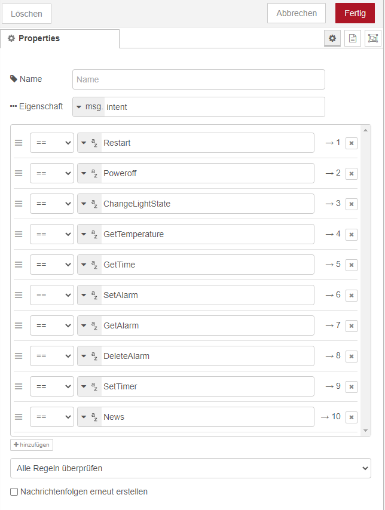
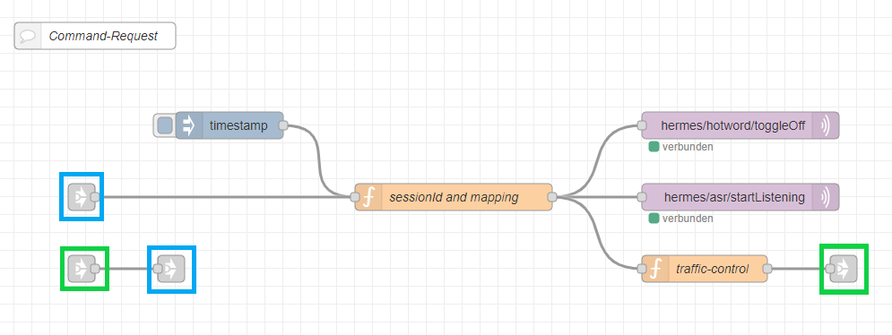

---
# This top area is to give jekyll information about the page.
layout: page
permalink: /tech-stack/hermesmqtt/
---

# HermesMQTT

Hermes is a mqtt-based protocol to control a homeassistant.  
You publish to specific topics to activate or start a function and subscribe to other topics to receive the results of these functions.  
For example to start [Kaldi](./kaldi.md), you have to publich to `hermes/asr/startListening` and subscribe to `hermes/asr/textCaptured` to receive the spoken text.  

## Node-Red

We used [Node-Red](./../information/node-red.md) to control our homeassistant.  

#### Dialogue-Manager

  
  
We started our dialogue-manager with an MQTT-node, which subscribed to `hermes/hotword/heimdall/detected`.
It will be triggered everytime out [wake-word](./../tech-stack/mycroft.md) "Heimdall" is detected.  
The following function-node then creates a new message with a `sessionId`, which is generated relative to the current time.  
The node toggles off the hotword-detection and starts the ASR-capturing, which in our case is [Kaldi](./kaldi.md), by publishing to `hermes/hotword/toggleOff` and `hermes/asr/startListening`.  
To receive the captured text, we subscribed to `hermes/asr/textCaptured` and filter the result by `sessionId` and `text`, which we then renamed to `input` for the nlu request.  
After filtering we stopped the ASR-capturing by publishing to `hermes/asr/stopListening` and send a request to [FuzzyWuzzy](./fuzzywuzzy.md) by publishing to `hermes/nlu/query`.  
We subscribed to `hermes/nlu/intentParsed` to receive the parsed intent and use two function nodes to convert the information to a JSON-file for the subsequent use.  
The wake-word gets reactivated by publishing to `hermes/hotword/toggleOn`.  
To know if the intent will not be recognized we subscribed to `hermes/nlu/intentNotRecognized`, which then reactivates the wake-word again.

````json
{
  "slots": {
    "name": "zimmerlampen",
    "light_state": "ein"
  },
  "sessionId": "2020-11-16T14:17:59.010Z",
  "intent": "ChangeLightState",
  "_msgid": "af195475.366548"
}
````
*Example output of our dialogue-manager.*

To see the full documentation of Hermes, click [here](https://docs.snips.ai/reference/hermes).

#### Intent-Switch

  

The function-node sets the `msg.payload` to `msg.intent` and defines a mqtt-topic to the `slot.name`:  
```js
    msg.payload = msg.intent;
    group = msg.slots.name;
    msg.topic = "zigbee2mqtt/"+group+"/set";
    return msg;
```
This helps to work with the right intent and automatically publishes the data to the right mqtt-topic.  
(e.g. `zigbee2mqtt/wohnzimmerlampe/set`)  

The switch-node directs the `msg` to the following nodes based on the intent:  
    
   

#### Audio output
  
To simplify the usage of our audio-output we decided to create two main audio-output-nodes, one for TTS and one to play `.wav`-files:   
  

##### TTS 

To use TTS you, simply have to publish a message to `hermes/tts/say`, which contains the following keys in its payload:  
- `text`: the text, which should be spoken
- `siteId`: to identify the source of the message (in our case `default`)

We decided to switch off the wake-word-detection and to delay our message to prevent detections by rhasspy itself.
After speaking the text, hermes publishes a message to `hermes/tts/sayFinished`, which we used to switch on the wake-word-detection.

##### .wav-files

To play `.wav`-files, you simply have to publish a message to `hermes/audioServer/<siteId>/playBytes/<RequestId>`, where `siteId` is to identify the source of the message and `RequestId` could be any string (in our case, we generate one with a function node).  
It will play any `.wav`-file, which is stored in `message.payload` (binary-payload).

We decided to switch off the wake-word-detection and to delay our message to prevent detections by rhasspy itself.
After playing the sound, hermes publishes a message to `hermes/audioServer/<siteId>/playFinished`, which we used to switch on the wake-word-detection.

#### Command-Request

We wanted to be able to trigger command-request without a wake-word.  
To reach this goal we added some nodes:  
  


The blue `link`-nodes are the in- and output-nodes of this function.  
The `link-in`-node will trigger the function and the `link-out`-node will return the intent.  
To see the function of the first `function`-node and the two `mqtt-out`-nodes, you should check our [dialogue-manager](#dialogue-manager).
The second `function`-node creates a new message and a `payload` with the value `false`, which later is used to toggle switches.  
  
We had to extend our [dialogue-manager](#dialogue-manager) by the following nodes:  
  
  
  
The two `traffic`-nodes decides where to pass the intents.  
If a wake-word is detected, the intent will be passed to our "[Intent-Switch](#intent-switch)".   
If no wake-word is detected, the intent will be passed to the "Command-Request-Output".
All new `function`-nodes were created to control the `traffic`-nodes.
