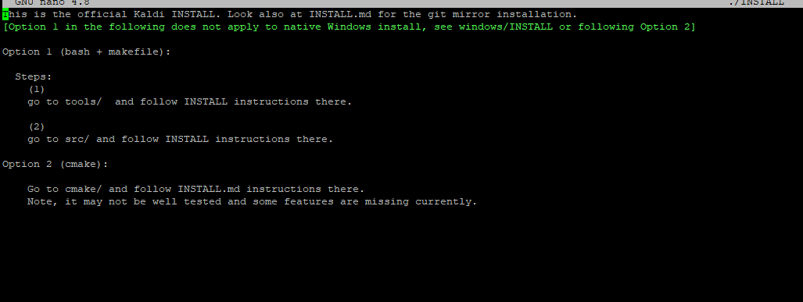
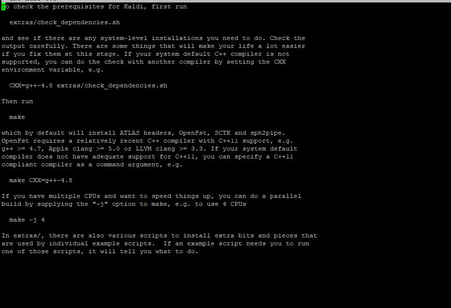
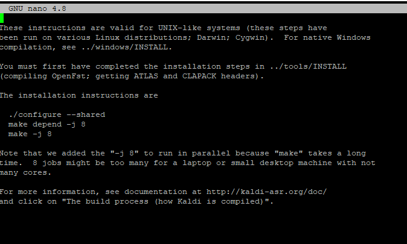

---
# This top area is to give jekyll information about the page.
layout: page
permalink: /tech-stack/kaldi/
title: Kaldi
subtitle: Speech to Text
hero_height: is-low
---

## Introduction

Kaldi is a C++ based speech recognition tool. It is licensed under [Apache License v2.0](https://www.apache.org/licenses/LICENSE-2.0) and used for **A**utomatic **S**peech **R**ecognition (**ASR**).  
After Precise activates the assistant by detecting the [wake-word](./mycroft.md#how-to-find-a-wake-word), Kaldi should transform the recorded sounds to text, which is passed on to [FuzzyWuzzy](./fuzzywuzzy.md) to interpret the users intent.  

## Install Kaldi
### Download
Clone the Kaldi repository and move into the folder.
```bash
    git clone https://github.com/kaldi-asr/kaldi.git kaldi --origin upstream
    cd kaldi
```

### Install
To install Kaldi follow the instructions in the INSTALL file.  
It will guide you to the INSTALL files in `kaldi/tools/` and `kaldi/src/`.  
After you followed all these instructions, you can move on with this guide.  

  
*/kaldi/INSTALL*  

  
*/kaldi/tools/INSTALL*  

  
*/kaldi/src/INSTALL*  

## Use Kaldi in Rhasspy
### Update your Rhasspy profile
You need to have Kaldi installed.
Then go to the Webinterface of Rhasspy and open the settings.  
Change "Speech to Text" to Kaldi and add the following lines to your profile.

```json
    {
      "speech_to_text": {
        "system": "kaldi",
        "kaldi": {
            "base_dictionary": "kaldi/base_dictionary.txt",
            "compatible": true,
            "custom_words": "kaldi/custom_words.txt",
            "dictionary": "kaldi/dictionary.txt",
            "graph": "kaldi/graph",
            "kaldi_dir": "~/kaldi",
            "language_model": "kaldi/language_model.txt",
            "model_dir": "kaldi/model",
            "unknown_words": "kaldi/unknown_words.txt",
            "language_model_type": "arpa"
        }
      }
    }
```
Set `kaldi_dir` to the directory, where you installed Kaldi in our case it's `~/kaldi`.  
Rhasspy will automatically delete all default lines e.g. ``"base_dictionary": "kaldi/base_dictionary.txt"``.  
After a restart of Rhasspy you should be able to use Kaldi as your STT-system.  

### Test Kaldi
Rhasspy automatically trains Kaldi, to expect your intents in the ``sentences.ini`` file. To test it, you can add a line to this file and save it.  
Rhasspy will ask to restart. Accept it and you are ready to test.  
Look in the terminal and start the recording by saying your wake-word or by using the "Wake Up"-button on the webinterface.  
Now say the line you added and wait a few seconds. Then scroll through your terminal until you find the line:  
````
[DEBUG:2020-10-13 07:35:27,316] rhasspyasr_kaldi.transcribe: ['wie spät ist es ', 'wie spät ist es ']
````
*We tried it with the sentence "wie spät ist es".*

Kaldi understands numbers and digits, too. So if there is a ``15`` or something like that in the ``sentences.ini`` file, Kaldi will understand the word ``fünfzehn`` (the german word for ``fifteen``).
````
[DEBUG:2020-10-14 13:20:10,706] rhasspyasr_kaldi.transcribe: ['fünfzehn ', 'fünfzehn ']
````

## Sources
[Kaldi-Documentation](https://kaldi-asr.org/doc/)
[Rhasspy-Documentation](https://rhasspy.readthedocs.io/en/latest/speech-to-text/)

## What's next?

The spoken text will be passed to [FuzzyWuzzy](./fuzzywuzzy.md) to understand your intent.