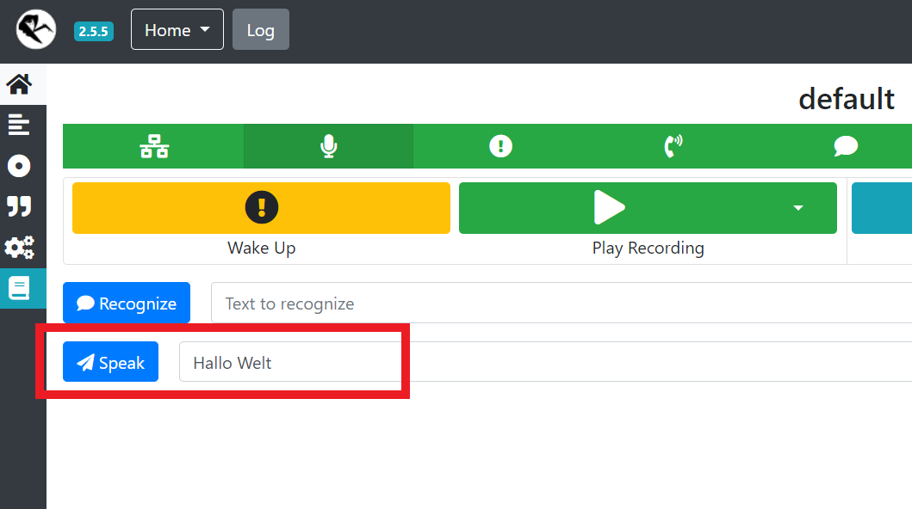

---
# This top area is to give jekyll information about the page.
layout: single
---

# MaryTTS

## Introduction
MaryTTS is a java-based open-source Text-to-Speech platform.  
It was developed by the [German Research Center for Artificial Intelligence](https://www.dfki.de/web/) and the [University of Saarland](https://www.uni-saarland.de/start.html).  
In our case we use the [MaryTTS-Installer](https://github.com/marytts/marytts-installer) to both install new languages and run the server,  
because we were unable to install new languages with the [Installer-GUI](https://github.com/marytts/marytts#downloading-and-installing-voices) due to our missing video output.  


## Install MaryTTS
### Download
Download the [MaryTTS-Installer](https://github.com/marytts/marytts-installer/releases) and unzip it.  
Go to the Directory where you downloaded it and install a language:  

```bash
    cd marytts-installer-5.2/
    ./marytts install voice-bits3-hsmm
```

*`bits3-hsmm` is a german male voice, you can try any voices [here](http://mary.dfki.de:59125/)*  

To run you server just need to type `./marytts` in the same directory.  
The server will be available at `http://localhost:59125/`.

### Run MaryTTS as a Service
We created a Service to start the MaryTTS server at boot up.  
To do so, type `sudo nano /etc/systemd/system/marytts.service` in the console and copy the following lines:  

```
    # Make sure to change ExecStart, WorkingDirectory
    # and Environment to the path, where you installed marytts

    [Unit]
    Description=MaryTTS
    
    [Service]
    WorkingDirectory=/home/pi/marytts-installer-5.2/
    ExecStart=/home/pi/marytts-installer-5.2/marytts
    Environment=GOPATH=/home/pi/marytts-installer-5.2
    Restart=always
    RestartSec=5
    TimeoutSec=10
    
    [Install]
    WantedBy=multi-user.target
```

Save and close the file.  
Enable and start the service by typing:  

```
    sudo systemctl enable marytts.service
    sudo systemctl start marytts.service
```
  
  

## Use MaryTTS in Rhasspy

For MaryTTS you need to have `OPENSSL_1_1_1` installed.  
To see how to do this, look at our troubleshooting-section for [OpenSSL](./../troubleshooting/openssl.md).  

### Update your profile

Go to your Rhasspy-profile or the webinterface and add the following lines:

```json
{
  "text_to_speech": {
      "marytts": {
          "locale": "de",
          "voice": "bits3-hsmm"
      },
      "system": "marytts"
  }
}
```

*Make sure to change `"locale"` and `"voice"` to whatever you installed*

### Test MaryTTS

Now you should be able to test MaryTTS by typing any word or sentence in the input-field of the webinterface.  
By pressing the "Speak"-button you should be able to hear the spoken text through your selected "Audio Playing"-service, in our case `aplay` (3.5mm-headphonejack).  
  

