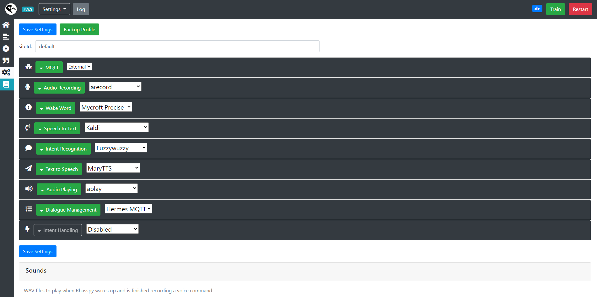
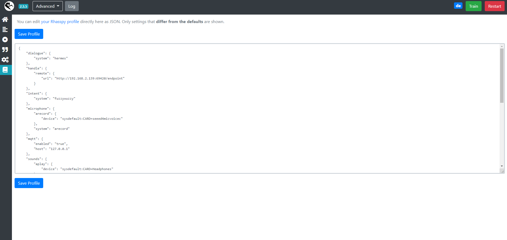
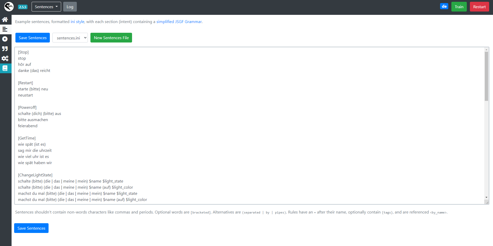
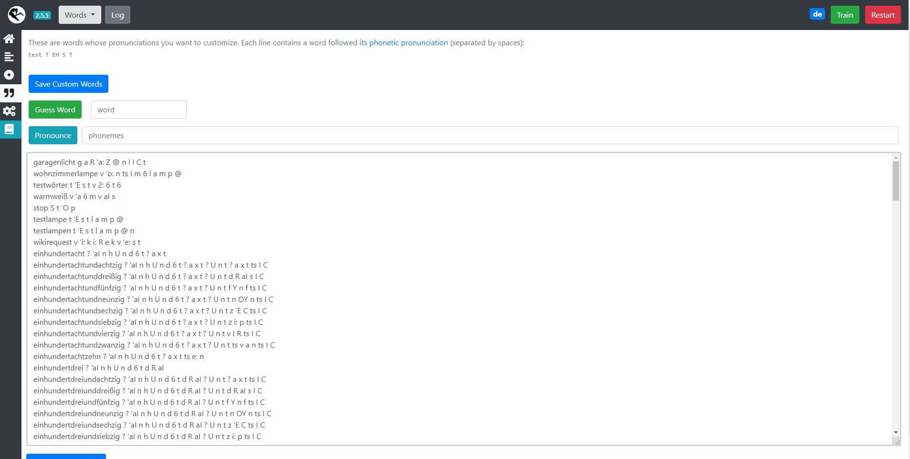
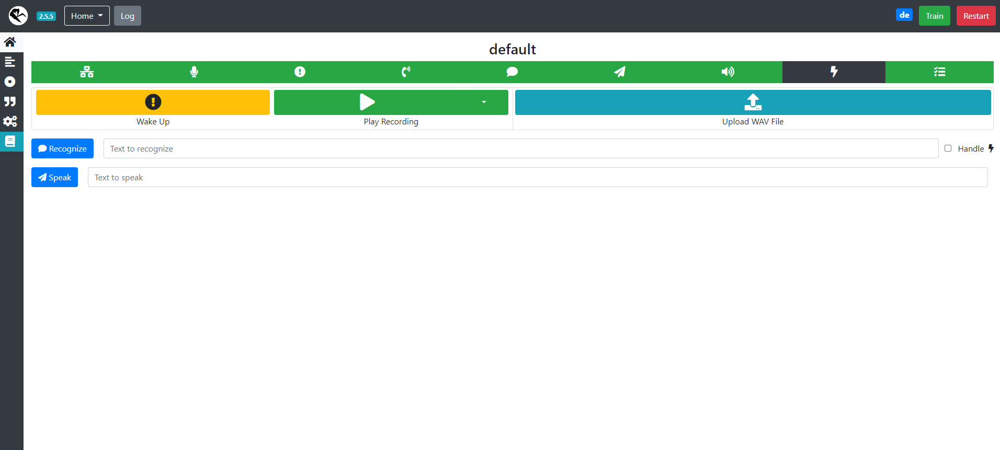

---
# This top area is to give jekyll information about the page.
layout: page
permalink: /tech-stack/rhasspy/
title: Rhasspy
hero_height: is-low
---

## Introduction

Rhasspy is the main core of our voice assistant.  
It manages all elements of our [Tech-Stack](./index.md) and offers the possibility to expand your assistant with [Home Assistant](https://www.home-assistant.io/).  

## Install Rhasspy
There are multiple ways to [install](https://rhasspy.readthedocs.io/en/latest/installation/) Rhasspy.  
We decided to go with release versions from [GitHub](https://github.com/rhasspy/rhasspy/releases).  
  
To install rhasspy follow these  steps:  
```textmate
    # download, install, and start Rhasspy
    
    wget https://github.com/rhasspy/rhasspy/releases/download/v2.5.5/rhasspy_2.5_armhf.deb
    sudo apt install ./rhasspy_2.5_armhf.deb
    rhasspy --profile de
```
*Here we are using the german profile of [version 2.5.5](https://github.com/rhasspy/rhasspy/releases/tag/v2.5.5)*

## Components
This is a quick run through the different components of the [Rhasspy-Webinterface](https://rhasspy.readthedocs.io/en/latest/#web-interface).  
If you want to get more information about this, we recommend you to visit the [documentation](https://rhasspy.readthedocs.io/en/latest/) of Rhasspy.  
You can find the webinterface at `http://<ip-of-your-device>:12101/`.  

### Settings
  
These are the main settings of Rhasspy.  
Here you can select the elements of your Tech-Stack from the dropdown-menus.  

### Profile
  
Alternatively to the settings-page, you can add some lines to your profile.  
You can find all the lines you have to add for our Tech-Stack, at the documentation of each technology.  

### Sentences
  
The sentences represent the actual voice commands, you have to use to trigger the features.  
Here you can see some examples of our features with a few variations.  
We have a list of each sentence, at its [feature documentation](./../features/index.md).  

### Dictionary
  
This is a dictionary of all words your Speech-To-Text element , in our case that is [Kaldi](./kaldi.md), cannot find in its default dictionary.  
If you add a new sentence with an unknown word, Rhasspy will notify you that you have to confirm its guesses or enter the word with the correct phonemes.  

### Testing-area
  
This is not only the landing page of the Rhasspy-Webinterface, but also the testing-area, where you can enter sentences to be recognized and start the assistant manually.  

## Sources
[Rhasspy-Documentation](https://rhasspy.readthedocs.io/en/latest/)  
[Rhasspy-Repository](https://github.com/rhasspy/rhasspy)  

## What's next?

If you want to know how to use our Tech-Stack, we recommend you to visit our documentation of [Mycroft-Precise](./mycroft.md).  
To understand how we communicate with our lights, you should take a look at our [MQTT-page](./mqtt.md).  
But if you want to know how we implemented our features, you should start with our [light-feature](./../features/lights.md).  