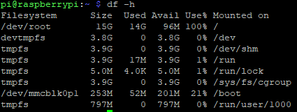
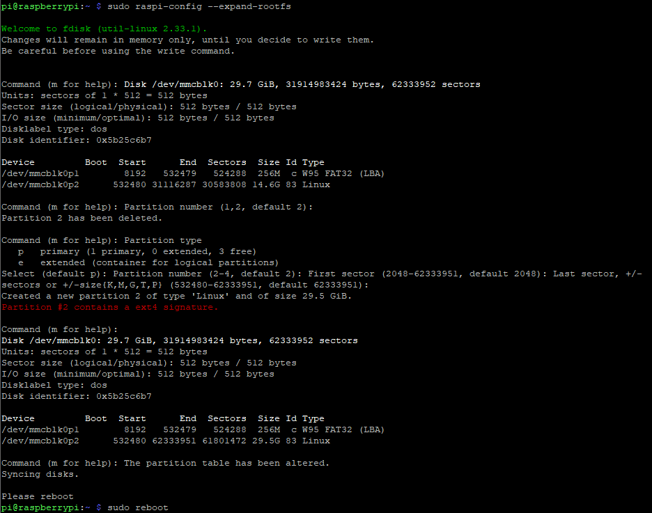
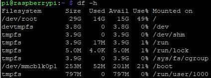

---
# This top area is to give jekyll information about the page.
layout: default
permalink: /troubleshooting/setup/
---

# Troubleshooting Setup

When using an image to set up a raspberry pi it can happen, that not all the space on the sd card is allocated. This can
result in to little hard drive space for all technologies to be installed.

## Using the command Line to expand the filesystem

With the command `df -h` we can list the filesystem (fs).



In the first row we can see that the `/dev/root` only takes up 15 GB of space. with `sudo raspi-config --expand-rootfs`






Here we can see that `/dev/root` uses almost all of the 32 GB of the SD-Card.


## Using pishrink

## Solutions that did not work

We used rufus to put an image of a 16 GB SD card on a 32 GB one which resulted in 14,98 GB unformatted space. Now we are 
trying the same with the Raspberry Pi Imager v1.4. 


https://www.easeus.com/partition-master/expand-windows-7-partition.html
https://stackoverflow.com/questions/19355036/how-to-create-an-img-image-of-a-disc-sd-card-without-including-free-space

reformatted the volume on Raspberry Pi SD card with Windows Volumemanager.

Raspberry py boot error:
```bash
Kernel panic-not syncing: VFS: unable to mount root fs on unknown-block(179,6)
```

Following [these instructions](https://raspberrypi.stackexchange.com/questions/40854/kernel-panic-not-syncing-vfs-unable-to-mount-root-fs-on-unknown-block179-6)
