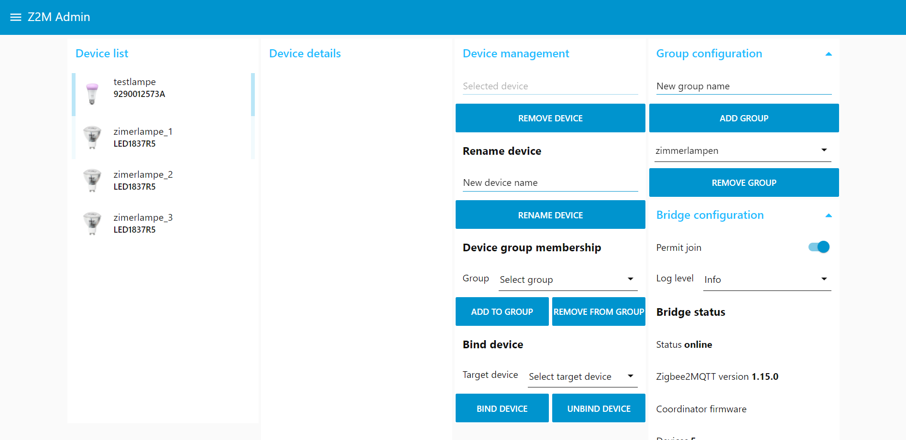
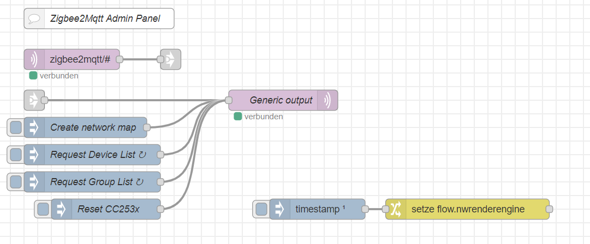

---
# This top area is to give jekyll information about the page.
layout: page
permalink: /users/adding-devices/
title: How to add your devices
subtitle: One Pi to rule them all
hero_height: is-low
---

## Rhasspy

To add new devices we have to go to [Rhasspy](./../tech-stack/rhasspy.md) first and change add new names for the device or new groups.  
To do so, we have to open the webinterface and navigate to the `slots`-tab and add new names.  
(Currently only lights are supported.)

## Node-Red/Mosquitto

After you added new names to Rhasspy, you have to register the device in the Mosquito-Broker.  
To simplify this process we use this [Zigbee2MQTT Admin Panel](https://flows.nodered.org/flow/1f1c0dde4ff193e5c14d5b99442a7d00).  
Open both the `Zigbee2MQTT Admin Panel`-flow and the `Zigbee2MQTT Admin Panel`-GUI in Node-Red.  
You can find the GUI at `http://<ip-of-your-voice-assistant>:1880/ui/`.  

   
*`Zigbee2MQTT Admin Panel`-GUI*  
  
   
*`Zigbee2MQTT Admin Panel`-flow*  
  

Follow the instructions of your device and activate the pairing-mode (make sure, that you have permitted joining in the GUI).  
Then you should press the `Request Device List`-Button on the `Z2M Admin`-flow and refresh the GUI-page.  
You should now be able to see your device on the left side of the GUI.  
Now you can add it to a group or create a new group, but make sure, that you use the exact same name as in Rhasspy.  
(If you do not want to use your device in a group, you have to change the name of the device in the GUI.)

## What's next?

Heimdall has some useful [features](./../features/index.md).
