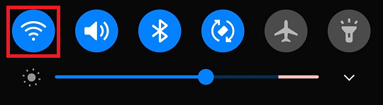
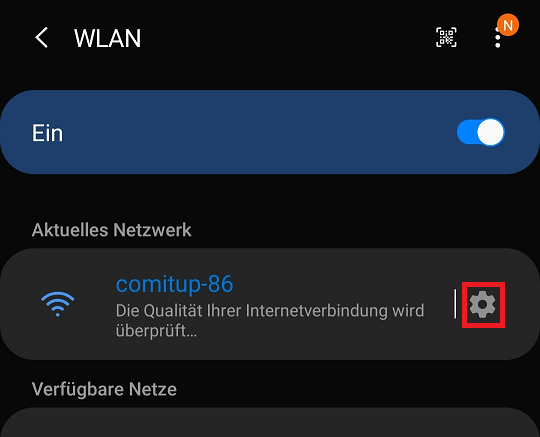
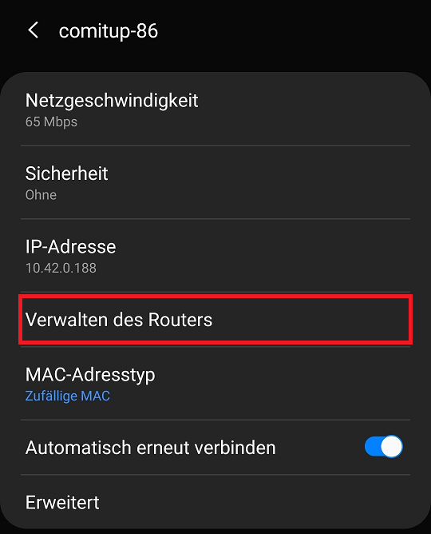
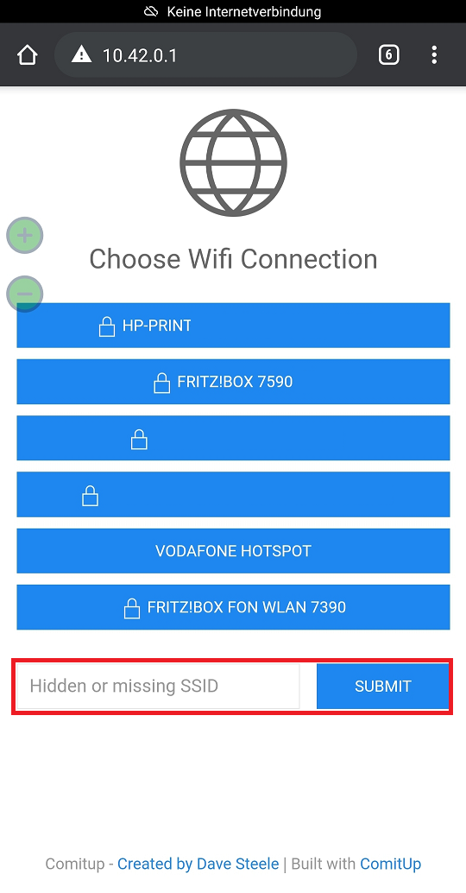

---
# This top area is to give jekyll information about the page.
layout: page
permalink: /users/wi-fi/
hero_height: is-low
---

## Connect by comitup

Comitup broadcasts a Wi-Fi Network, if the Raspberry Pi is not connected to one. We can use this to control the Pi and 
 connect it to our Wi-Fi.

### Connect to Raspberry Pi

Now we use a Wi-Fi capable device like a laptop or smartphone to connect to the hotspot. Open the Wi-Fi network dialog.
    Connect to the network named "Comitup-nn", where nn is a randomized two-digit ID. This ID might be important in the next
    step.

### Enter your Wi-Fi Credentials

####For Android  

In this case we used a Galaxy Note 10+ and Google Chrome as test device and assume, that other Android devices work
    similarly, but we won't test with other devices.

For android phones you can enter the Wi-Fi settings. Hold the Wi-Fi icon in your quick-menu.

Tap the cog-icon next to the comitup network.

There you can Tap "Verwalten des Routers"

The browser will open, and we can select the ssid of our network or search a hidden or missing one.

#### For Windows

After connecting to the comitup hotspot you can enter the following address in your browser end connect to the comitup dialog.
    "http://comitup-nn.local" remember to replace nn with the network's ID.

If this is not working you might be able to use "http://10.41.0.1.", the dot at the end of the IP-address is supposed
    to be part of the hack, but this has not worked for us.

#### For IOs

Unfortunately we don't have an IOs device to test on.

## Connect by wpa_supplicant.conf

Look at the [Setup Guide](../setup.md)

## What's next?

Adding new [smart devices](./adding-devices.md).